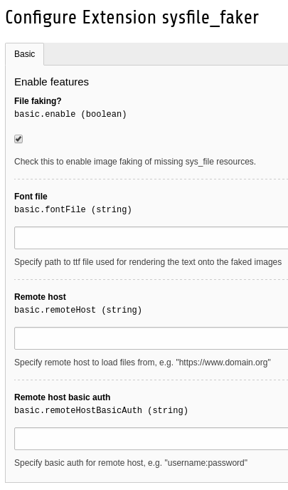

sys_file faker
==============

Once installed and enabled this TYPO3 extension creates dummy image files (jpg, png, gif) when trying to read a `sys_file_references` in case the referenced `sys_file record` lost its file.

(!) Only recommended for development contexts. Don't use this experimental extension on production systems!

Settings
--------

Checking the checkbox enables file faking for missing FAL files.

Specifing a remote host enables remote fetching of the record from said host. If that fails the file faking is next.

Btw.: missing folders will be generated on the fly.
